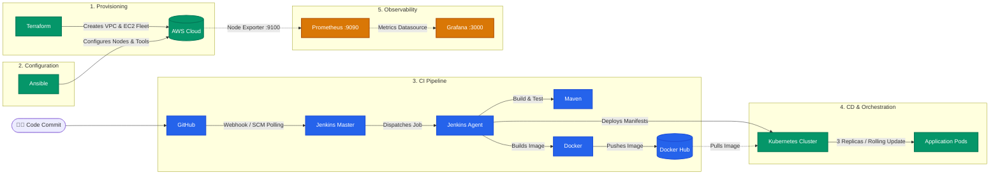

# 🚀 End-to-End Cloud DevOps & CI/CD Pipeline

> **Production-grade DevOps workflow for deploying a containerized microservice on AWS using Terraform, Ansible, Jenkins, Docker, Kubernetes, Prometheus, and Grafana.**

[](https://aws.amazon.com/)
[](https://www.terraform.io/)
[](https://www.ansible.com/)
[](https://www.jenkins.io/)
[](https://www.docker.com/)
[](https://kubernetes.io/)
[](https://prometheus.io/)
[](https://grafana.com/)

---

## 📌 DevOps Overview

This repository demonstrates a complete, automated **DevOps lifecycle** for deploying cloud workloads with zero manual server configuration. Every phase—from cloud infrastructure provisioning and configuration management to continuous integration, continuous delivery, and full-stack observability—is automated as code.



---

## 🔄 End-to-End DevOps Workflow

The pipeline is split into five automated stages:

### Stage 1: Infrastructure as Code (Terraform)
* Provisions a custom **AWS VPC** (`10.0.0.0/16`) with an **Internet Gateway** and public route tables.
* Deploys public subnets across multiple **Availability Zones** (`ap-south-1a`, `ap-south-1b`) for high network resilience.
* Creates security groups strictly following the principle of least privilege.
* Launches an EC2 server fleet running **Ubuntu 22.04 LTS**:
  * **Ansible Controller**: Central node for configuration management.
  * **Jenkins Master**: CI/CD pipeline scheduler and controller.
  * **Jenkins Slave / Build Server**: Dedicated build node for compiling code and building Docker images.
  * **Monitoring Server**: Dedicated Prometheus and Grafana instance.
* Automatically generates an SSH keypair (`banking_key.pem`) and dynamic Ansible inventory files (`inventory.ini`).

### Stage 2: Configuration Management (Ansible)
* **Fleet Baseline (`common`)**: Provisions a 2GB swapfile on all `t3.micro` instances to prevent Out-Of-Memory (OOM) errors during heavy build steps; installs system utilities and **Prometheus Node Exporter** (`port 9100`).
* **Jenkins Master Setup (`jenkins_master`)**: Automates installation of OpenJDK 21, installs Jenkins LTS, tunes JVM memory (`-Xms256m -Xmx512m`), and enables systemd services.
* **Build Node Setup (`jenkins_slave`)**: Installs OpenJDK 21 (agent runtime), OpenJDK 17 (application build requirement), Maven 3, Docker Engine (adding the automation user to the `docker` group), Trivy security scanner, and AWS CLI.
* **Monitoring Setup (`prometheus` & `grafana`)**: Deploys Prometheus with automated target discovery for all fleet node IPs, and configures Grafana with Prometheus pre-connected as a datasource.

### Stage 3: Continuous Integration (Jenkins Distributed Pipeline)
* Uses a **Master-Slave** architecture to keep the CI controller lightweight and offload heavy builds to the agent node.
* **Automated Stages**:
  1. **SCM Checkout**: Clones the latest branch commit from GitHub.
  2. **Application Build**: Compiles source code and runs unit tests using Maven (`mvn clean package`).
  3. **Containerization**: Packages the application artifact into a lightweight Docker image tagged with both the unique `${BUILD_NUMBER}` and `latest`.
  4. **Registry Push**: Authenticates to Docker Hub using Jenkins credentials and pushes the newly built image.

### Stage 4: Continuous Delivery & Orchestration (Kubernetes)
* Deploys the containerized application to the Kubernetes cluster using `bankingdeploy.yaml`.
* **Deployment Specifications**:
  * **3 Replicas** for load sharing and redundancy.
  * **Rolling Update Strategy**: Eliminates downtime by ensuring new pods are healthy before terminating older ones.
  * **Self-Healing**: Kubernetes automatically replaces failed or unresponsive pods.
* **Service Networking**:
  * Exposes the pods via a **NodePort Service** on port `31022`, routing external requests to container port `8082`.

### Stage 5: Continuous Monitoring & Telemetry (Prometheus + Grafana)
* **Prometheus (`port 9090`)**: Continuously scrapes CPU utilization, RAM usage, network traffic, and disk I/O metrics from each fleet instance via Node Exporter (`port 9100`).
* **Grafana (`port 3000`)**: Displays visual dashboards for real-time fleet health, alerting on resource bottlenecks and cluster performance.

---

## 🏗️ Cloud Infrastructure & Port Reference

| Node | Purpose | Installed Stack | Inbound Ports |
|:---|:---|:---|:---|
| **Ansible Controller** | Config management & playbook execution | Ansible Core, Python3, Git, OpenSSH | `22` (SSH) |
| **Jenkins Master** | Pipeline scheduling & web interface | OpenJDK 21, Jenkins LTS | `8080` (Web UI), `50000` (Agent JNLP), `22` (SSH) |
| **Jenkins Slave** | Build executor & container publisher | OpenJDK 21/17, Maven 3, Docker Engine, Trivy, AWS CLI | `22` (SSH), `9100` (Node Exporter) |
| **Monitoring Server** | Fleet metrics collection & dashboards | Prometheus Server, Grafana | `9090` (Prometheus), `3000` (Grafana), `9100` (Node Exporter), `22` (SSH) |
| **Kubernetes Workload**| Container orchestration & app runtime | Kubernetes Pods (3 Replicas), NodePort Service | `31022` (NodePort), `8082` (Container) |

---

## 📂 Repository Layout

```text
├── Terraform/                 # Infrastructure as Code
│   ├── vpc.tf                 # VPC, subnets, route tables, and gateway
│   ├── ec2.tf                 # EC2 instance specifications
│   ├── security_groups.tf     # Network firewall ingress/egress rules
│   ├── inventory.tf           # Dynamic Ansible inventory templates
│   ├── variables.tf           # Configurable infrastructure variables
│   ├── outputs.tf             # Fleet IPs, URLs, and connection strings
│   ├── scripts/               # PowerShell cost-saving fleet pause/resume scripts
│   └── ansible/               # Production Ansible roles (common, jenkins, monitoring)
│
├── ansible/                   # Deployment automation
│   ├── jenkin-setup/          # Modular playbooks for master & slave configuration
│   └── deployment/            # Jenkins declarative pipeline (deploy.yml) & k8s targets
│
├── bankingdeploy.yaml         # Kubernetes Deployment (3 replicas) & NodePort Service
├── Dockerfile                 # Multi-stage Java 17 container build definition
└── pom.xml                    # Maven application dependencies & build plugins
```

---

## ⚡ Quick Pipeline Execution Reference

### 1. Provision Infrastructure
```bash
cd Terraform
terraform init
terraform plan
terraform apply -auto-approve
```

### 2. Configure Fleet Software
```bash
cd Terraform/ansible
ansible-playbook -i inventory.ini site.yml
```

### 3. Run CI/CD Pipeline
* Access the Jenkins UI at `http://<JENKINS_MASTER_IP>:8080`.
* Run the pipeline job configured from `ansible/deployment/deploy.yml`.
* The pipeline automatically builds the code, produces the Docker image, pushes to Docker Hub, and triggers deployment on Kubernetes.

### 4. Verify Kubernetes Rollout
```bash
kubectl apply -f bankingdeploy.yaml
kubectl rollout status deployment/bankingapp-deploy
kubectl get pods -l app=bankapp-pod-lbl
kubectl get svc bankingapp-np-service
```

### 5. Monitor Infrastructure
* **Prometheus Targets**: `http://<MONITORING_SERVER_IP>:9090/targets`
* **Grafana Dashboards**: `http://<MONITORING_SERVER_IP>:3000`

---

## 💰 Cost Optimization (Fleet Automation)

To minimize AWS infrastructure costs during practice or downtime without losing disk state or installed configurations:

* **Pause All Servers ($0 Compute & IP Charges):**
  ```powershell
  .\Terraform\scripts\stop_all.ps1
  ```
* **Resume All Servers (Auto-refreshes IPs & Inventory):**
  ```powershell
  .\Terraform\scripts\start_all.ps1
  ```
* **Tear Down All Cloud Resources:**
  ```bash
  cd Terraform
  terraform destroy -auto-approve
  ```

---

## 📁 Repository Modules & Component Links

* **Infrastructure Provisioning**: [`Terraform/`](Terraform)
* **Configuration Management**: [`Terraform/ansible/`](Terraform/ansible) & [`ansible/`](ansible)
* **CI/CD Pipeline Definition**: [`ansible/deployment/deploy.yml`](ansible/deployment/deploy.yml)
* **Kubernetes Orchestration**: [`bankingdeploy.yaml`](bankingdeploy.yaml)
* **Application Dockerfile**: [`Dockerfile`](Dockerfile)

---

## 👨‍💻 Author

* **Sheikh Mufaiz** — [GitHub Profile](https://github.com/sheikh-mufaiz)
